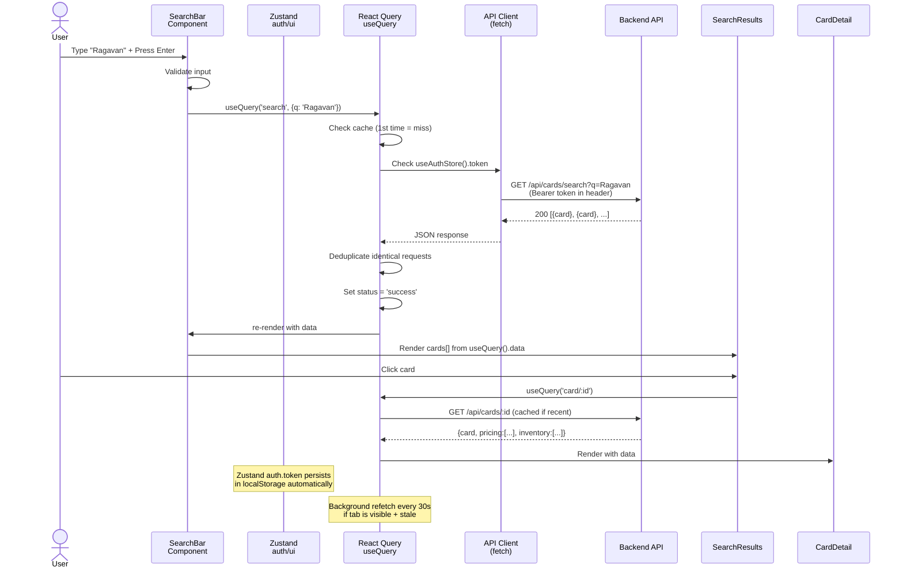

# Frontend Architecture

Complete guide to the AutoMana React application, including component patterns, state management, API integration, testing, and deployment.

> **Start here for system-wide understanding.** For the full system (frontend + backend), see [`docs/ARCHITECTURE_MASTER.md`](ARCHITECTURE_MASTER.md).

## Frontend Overview

The frontend is a React 18 single-page application (SPA) built with Vite, providing users with:
- Card collection management (add/remove/organize cards)
- Price tracking and analytics
- Integration with eBay and Shopify for inventory sync
- Search and filtering capabilities
- Responsive UI for desktop and mobile

### Tech Stack Rationale

**React 18** chosen for: component reusability, large ecosystem, strong typing with TypeScript, proven production stability. Alternatives (Vue, Angular, Svelte) considered but React's ecosystem and team experience won out.

**Vite** chosen for: 10x faster dev builds than Webpack, native ESM, instant HMR. Webpack remains the industry standard but Vite's DX is superior for this project.

**Zustand 5.0** chosen for: lightweight state management (~2KB), minimal boilerplate, no provider setup, built-in persistence middleware for local storage, native TypeScript support. Alternatives considered: Redux (too much boilerplate), Pinia (Vue-focused), Recoil (overkill for current complexity).

---

## Table of Contents

### Architecture & Patterns (Component, Routing, State)
- [Component Architecture & Design System](frontend/architecture/COMPONENTS.md)
- [Routing & Navigation](frontend/architecture/ROUTING.md)
- [State Management Architecture](frontend/architecture/STATE_MANAGEMENT.md)

### Integration & Data (APIs, Authentication)
- [API Integration & Data Fetching](frontend/integration/API_INTEGRATION.md)
- [Authentication & Authorization](frontend/integration/AUTHENTICATION.md)

### User Experience (Forms)
- [Forms & Validation](frontend/user-experience/FORMS.md)

### Quality & Deployment (Testing, Build)
- [Testing Strategy](frontend/quality-operations/TESTING.md)
- [Build, Deployment & Performance](frontend/quality-operations/BUILD_DEPLOYMENT.md)

---

## Architecture Diagram

```mermaid
graph TD
    subgraph Routes["Routes (TanStack Router)"]
        Root[__root: Auth Guard]
        Landing[/ Landing Page]
        Login[/login Login Page]
        Search[/search Search Results]
        CardDetail[/cards/$id Card Detail]
    end
    
    subgraph Features["Features (Feature-Based)"]
        Cards["cards/
        ├── api.ts (API calls)
        ├── types.ts (CardType, PriceData)
        ├── components/ (Feature UI)
        └── __tests__/"]
    end
    
    subgraph Components["Shared Components"]
        Layout["layout/
        ├── AppShell (root wrapper)
        ├── TopBar (nav bar)
        └── Sidebar (navigation)"]
        UI["ui/
        ├── Button, Toggle, Panel
        ├── Chip (tag display)
        └── index.ts (barrel export)"]
        DS["design-system/
        ├── Icon (SVG icons)
        ├── CardArt (rendering)
        ├── AreaChart, Sparkline
        ├── PriceBand (pricing viz)
        ├── AIBadge (AI features)
        ├── Pip (MTG mana pips)
        └── SuggestionsDropdown"]
    end
    
    subgraph Store["Global State (Zustand)"]
        Auth["auth.ts
        ├── token: string | null
        ├── currentUser: User
        ├── login()
        └── logout()
        persist: localStorage"]
        UI["ui.ts
        ├── theme: dark | light
        ├── setTheme()
        ├── toggleTheme()
        └── persist: localStorage"]
    end
    
    subgraph Data["Data Layer"]
        QC["React Query
        ├── Automatic caching
        ├── Stale-while-revalidate
        └── Retry logic"]
        API["API Client
        ├── cards API
        ├── pricing API
        └── inventory API"]
        MSW["MSW (dev mocks)
        └── Intercepts fetch requests"]
    end
    
    Routes -->|navigate| Features
    Routes -->|use| Components
    Routes -->|dispatch| Store
    Features -->|render| Components
    Features -->|query & mutate| Data
    Components -->|read| Store
    Data -->|HTTP| API
    Data -->|dev-only| MSW
```

---

## Key Design Decisions Summary

| Decision | Rationale | Alternatives | Trade-offs |
|---|---|---|---|
| React 18 | Large ecosystem, strong typing, team experience | Vue, Angular, Svelte | Larger bundle size, steeper learning curve for new team members |
| Vite | 10x faster builds, native ESM, instant HMR | Webpack, Parcel | Smaller ecosystem, younger project |
| Zustand 5.0 | Minimal boilerplate, built-in persistence, no provider wrappers | Redux (boilerplate-heavy), Recoil (overkill) | Learning curve minimal, mature ecosystem |
| Feature-based structure | Collocate feature logic, types, tests, components together | Atomic pattern (separate by type) | Features can grow large; clearer ownership |
| TanStack Router | Type-safe routing, file-based routes, full loader/action support | React Router v6 (less type-safe) | Newer project, emerging standard |
| React Query | Automatic caching, deduplication, background refetch, dev tools | Fetch API (manual), swr | Adds ~35KB, but saves 10x the code |

---

## Request/Data Lifecycle



---

## Component Hierarchy Overview

```
src/frontend/src/
├── main.tsx
│   └── <QueryClientProvider>
│       └── <RouterProvider>
│           └── routes/__root.tsx (auth guard, outlet)
│
├── routes/
│   ├── __root.tsx ..................... Root layout + auth guard
│   │   └── <Outlet />
│   │       ├── index.tsx (Landing) ... / — public landing page
│   │       ├── login.tsx ............ /login — auth page
│   │       ├── search.tsx ........... /search — cards search
│   │       └── cards.$id.tsx ........ /cards/:id — card detail
│   │
│   └── routeTree.gen.ts ............ Auto-generated by TanStack Router
│
├── components/
│   ├── layout/
│   │   ├── AppShell.tsx .............. Root wrapper (for auth pages)
│   │   ├── TopBar.tsx ............... Header with logo, user menu
│   │   └── Sidebar.tsx .............. Left nav (search, filters)
│   │
│   ├── ui/
│   │   ├── Button.tsx ............... Reusable button (variant, size)
│   │   ├── Toggle.tsx ............... On/off switch
│   │   ├── Panel.tsx ................ Card/box container
│   │   ├── Chip.tsx ................. Tag/badge display
│   │   └── index.ts ................. Barrel export
│   │
│   └── design-system/
│       ├── Icon.tsx ................. SVG icon (kind: 'chart'|'wallet'|'bag'|...)
│       ├── CardArt.tsx .............. MTG card image + overlay
│       ├── AreaChart.tsx ............ Price history graph
│       ├── Sparkline.tsx ............ Compact trend line
│       ├── PriceBand.tsx ............ Price range display
│       ├── Pip.tsx .................. MTG mana symbol
│       ├── AIBadge.tsx .............. AI-powered tag
│       └── SuggestionsDropdown.tsx .. Autocomplete dropdown
│
├── features/
│   └── cards/
│       ├── api.ts ................... API calls (searchCards, getCard, etc.)
│       ├── types.ts ................. CardType, PriceData, SearchQuery
│       ├── components/
│       │   ├── SearchBarWithSuggestions.tsx .. Search input + dropdown
│       │   ├── SearchFilters.tsx ............ Filter UI (set, rarity, etc.)
│       │   ├── SearchResults.tsx ........... Results grid/list
│       │   ├── CardDetailView.tsx ......... Full card view + pricing
│       │   └── __tests__/
│       │
│       └── __tests__/
│
├── store/
│   ├── auth.ts ...................... useAuthStore (token, currentUser)
│   └── ui.ts ....................... useUIStore (theme: dark|light)
│
├── lib/
│   ├── queryClient.ts ............... React Query configuration
│   └── ... (API client, utilities)
│
├── mocks/
│   └── browser.ts ................... MSW handlers for dev
│
├── styles/
│   └── global.css ................... Global CSS variables
│
└── routeTree.gen.ts ................. Auto-generated route tree
```

---

## Feature Directory

| Feature | Location | Purpose | Entry Point | Status |
|---|---|---|---|---|
| **Cards** | `src/features/cards/` | Search, filter, view, and track MTG cards across all sets | `/search` (route) | Core, active |

---

## Operational Considerations

### Performance Bottlenecks
- **Card list rendering**: Large result sets (27,840+ cards) require virtualization; currently using standard map rendering
- **Price history charts**: AreaChart and Sparkline components render on every price update; consider memoization
- **Search autocomplete**: SuggestionsDropdown fires API calls on every keystroke; implement debounce/request coalescing

### Bundle Size Management
- React Query (~35KB) + Zustand (~2KB) + TanStack Router (~10KB) = ~47KB for state management
- Design system (Icon, CardArt, charts) accounts for ~30KB (mostly SVG definitions)
- Target: Keep gzipped bundle <150KB for landing page, <250KB for logged-in app
- Leverage code splitting by route (TanStack Router supports this natively)

### Runtime Performance
- Zustand persistence middleware reads localStorage on mount (synchronous); fine for <100KB state
- React Query's stale-while-revalidate is enabled by default; background refetch frequency set in `queryClient.ts`
- Card image rendering (CardArt) uses `object-fit: cover` to avoid layout shifts
- Theme toggle (useUIStore) applies class to document root synchronously to avoid flash

---

## Quick Start for New Developers

1. Read [Component Architecture & Design System](frontend/architecture/COMPONENTS.md) to understand how components are organized
2. Read [Routing & Navigation](frontend/architecture/ROUTING.md) to understand how pages are navigated
3. Read [State Management Architecture](frontend/architecture/STATE_MANAGEMENT.md) to understand global state
4. Read [API Integration & Data Fetching](frontend/integration/API_INTEGRATION.md) to understand data flow
5. For authentication details, see [Authentication & Authorization](frontend/integration/AUTHENTICATION.md)
6. For forms, see [Forms & Validation](frontend/user-experience/FORMS.md)
7. For testing, see [Testing Strategy](frontend/quality-operations/TESTING.md)
8. For production, see [Build, Deployment & Performance](frontend/quality-operations/BUILD_DEPLOYMENT.md)
