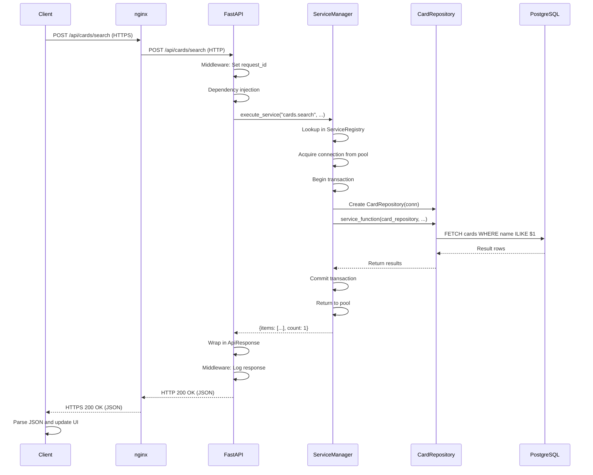

# Request Flows

This document traces the complete flow of requests through the AutoMana system, from entry point to response. Two main patterns are covered: HTTP requests and Celery background jobs.

## Request Flow Overview

AutoMana handles two types of requests:

1. **HTTP Requests**: Synchronous requests from the web client or external APIs (e.g., eBay webhooks)
2. **Celery Background Jobs**: Asynchronous tasks scheduled for later execution (e.g., nightly price sync)

Both flows use the same `ServiceManager` and layered architecture, but with different entry points.

## HTTP Request Flow (Step-by-Step)

### Overview Diagram

```
┌─────────────────────────────────────────────────────────────────────────┐
│ 1. Client sends HTTPS request                                           │
│    POST /api/cards/search?query=black+lotus                             │
└─────────────────────────────────────────────────────────────────────────┘
                                    ↓
┌─────────────────────────────────────────────────────────────────────────┐
│ 2. nginx (reverse proxy) receives HTTPS on port 443                      │
│    ├─ Decrypts TLS (port 443 → 8000)                                    │
│    ├─ Routes to FastAPI backend                                         │
│    └─ Logs request metadata                                             │
└─────────────────────────────────────────────────────────────────────────┘
                                    ↓
┌─────────────────────────────────────────────────────────────────────────┐
│ 3. FastAPI middleware chain                                              │
│    ├─ CORS middleware (if cross-origin request)                         │
│    ├─ RequestLoggingMiddleware: Sets request_id UUID                    │
│    │  └─ logging_context.set_request_id(request_id)                     │
│    └─ Returns control to route handler                                  │
└─────────────────────────────────────────────────────────────────────────┘
                                    ↓
┌─────────────────────────────────────────────────────────────────────────┐
│ 4. Router function receives request                                      │
│    ├─ Input validation via Pydantic                                     │
│    │  └─ query parameter validated as string                            │
│    ├─ Dependency injection                                              │
│    │  ├─ service_manager: ServiceManagerDep (singleton)                │
│    │  └─ current_user: CurrentUserDep (from session cookie)            │
│    └─ Router function begins execution                                  │
└─────────────────────────────────────────────────────────────────────────┘
                                    ↓
┌─────────────────────────────────────────────────────────────────────────┐
│ 5. Router calls ServiceManager.execute_service()                         │
│    await service_manager.execute_service(                               │
│        "cards.search",          # Service key                           │
│        query="black lotus",     # Caller parameters                     │
│        current_user=user,       # Optional context                      │
│    )                                                                    │
└─────────────────────────────────────────────────────────────────────────┘
                                    ↓
┌─────────────────────────────────────────────────────────────────────────┐
│ 6. ServiceManager._execute_service()                                     │
│    ├─ Look up "cards.search" in ServiceRegistry                         │
│    │  └─ Returns: ServiceConfig with module, function, repositories     │
│    ├─ Acquire connection from pool                                      │
│    │  └─ async with self._get_connection() as conn:                     │
│    ├─ OR begin transaction (if runs_in_transaction=True)                │
│    │  └─ async with self.transaction() as conn:                        │
│    ├─ Set command_timeout (if configured)                              │
│    │  ├─ Client-side: conn._config.command_timeout = 30.0              │
│    │  └─ Server-side: await conn.execute("SET LOCAL statement_timeout")│
│    └─ Instantiate repositories                                          │
│        ├─ CardRepository(conn, query_executor)                          │
│        ├─ PricingRepository(conn, query_executor)                       │
│        └─ Pass repositories as kwargs to service function               │
└─────────────────────────────────────────────────────────────────────────┘
                                    ↓
┌─────────────────────────────────────────────────────────────────────────┐
│ 7. Service function executes (business logic)                            │
│    async def search_service(                                            │
│        cards_repository,    # Injected                                  │
│        pricing_repository,  # Injected                                  │
│        query: str,          # From caller                               │
│    ):                                                                  │
│        # Service applies business logic:                                │
│        results = await cards_repository.search(query)                   │
│        # Filter by business rules, enrich data, etc.                    │
│        return {"items": results, "count": len(results)}                │
└─────────────────────────────────────────────────────────────────────────┘
                                    ↓
┌─────────────────────────────────────────────────────────────────────────┐
│ 8. Repository executes SQL queries                                       │
│    async def search(self, query: str):                                  │
│        sql = "SELECT * FROM card_catalog.cards WHERE name ILIKE $1"    │
│        result = await self.connection.fetch(sql, f"%{query}%")         │
│        return result                                                    │
└─────────────────────────────────────────────────────────────────────────┘
                                    ↓
┌─────────────────────────────────────────────────────────────────────────┐
│ 9. PostgreSQL executes query                                             │
│    ├─ Connection received from asyncpg                                  │
│    ├─ Query optimizer determines execution plan                         │
│    ├─ Indexes used for fast lookup                                      │
│    ├─ Rows fetched from disk/page cache                                 │
│    ├─ Result sorted/filtered as needed                                  │
│    └─ Result set returned to asyncpg                                    │
└─────────────────────────────────────────────────────────────────────────┘
                                    ↓
┌─────────────────────────────────────────────────────────────────────────┐
│ 10. Repository returns result to service                                 │
│     result = [{"id": 1, "name": "Black Lotus", ...}, ...]              │
└─────────────────────────────────────────────────────────────────────────┘
                                    ↓
┌─────────────────────────────────────────────────────────────────────────┐
│ 11. Service returns result to ServiceManager                             │
│     return {"items": result, "count": len(result)}                      │
└─────────────────────────────────────────────────────────────────────────┘
                                    ↓
┌─────────────────────────────────────────────────────────────────────────┐
│ 12. ServiceManager commits transaction (if applicable)                   │
│     ├─ If runs_in_transaction=True: await transaction.commit()         │
│     │  └─ All queries are atomically committed                         │
│     ├─ Connection returned to pool                                      │
│     └─ Timeout overrides are cleared                                    │
└─────────────────────────────────────────────────────────────────────────┘
                                    ↓
┌─────────────────────────────────────────────────────────────────────────┐
│ 13. Router wraps result in response                                      │
│     return ApiResponse(                                                 │
│         data=result,                                                    │
│         status="success",                                              │
│         request_id=request_context.request_id,                         │
│     )                                                                   │
└─────────────────────────────────────────────────────────────────────────┘
                                    ↓
┌─────────────────────────────────────────────────────────────────────────┐
│ 14. FastAPI serializes response                                          │
│     ├─ Response object is converted to JSON                             │
│     ├─ Status code set (200 OK)                                         │
│     ├─ Content-Type: application/json                                   │
│     └─ Response headers set                                             │
└─────────────────────────────────────────────────────────────────────────┘
                                    ↓
┌─────────────────────────────────────────────────────────────────────────┐
│ 15. Middleware logs response                                             │
│     logger.info("request_completed", extra={                            │
│         "request_id": "uuid-here",                                      │
│         "method": "POST",                                               │
│         "path": "/api/cards/search",                                    │
│         "status_code": 200,                                             │
│         "duration_ms": 145,                                             │
│     })                                                                  │
└─────────────────────────────────────────────────────────────────────────┘
                                    ↓
┌─────────────────────────────────────────────────────────────────────────┐
│ 16. nginx sends HTTPS response to client                                 │
│     HTTP/1.1 200 OK                                                     │
│     Content-Type: application/json                                      │
│     Content-Length: 1234                                                │
│                                                                         │
│     {                                                                   │
│       "data": {                                                         │
│         "items": [{"id": 1, "name": "Black Lotus", ...}],              │
│         "count": 1                                                      │
│       },                                                                │
│       "status": "success",                                              │
│       "request_id": "550e8400-e29b-41d4-a716-446655440000"             │
│     }                                                                   │
└─────────────────────────────────────────────────────────────────────────┘
                                    ↓
┌─────────────────────────────────────────────────────────────────────────┐
│ 17. Client receives response                                             │
│     ├─ Browser or API client receives JSON                              │
│     ├─ JavaScript parses response                                       │
│     └─ UI updates with search results                                   │
└─────────────────────────────────────────────────────────────────────────┘
```

### Sequence Diagram (Mermaid)



## Celery Background Job Flow (Step-by-Step)

Celery tasks (background jobs) use the same `ServiceManager` and layered architecture, but with a different entry point:

### Overview Diagram

```
┌─────────────────────────────────────────────────────────────────────────┐
│ 1. Task is enqueued                                                     │
│    - From a router: service_manager.execute_service("prices.sync", ...) │
│    - From Beat scheduler: cron job triggers at scheduled time          │
│    - From another task: task.delay() or send_task()                    │
└─────────────────────────────────────────────────────────────────────────┘
                                    ↓
┌─────────────────────────────────────────────────────────────────────────┐
│ 2. Task message is written to Redis queue                                │
│    {                                                                     │
│        "id": "task-uuid",                                                │
│        "task": "automana.worker.tasks.pricing_tasks.sync_prices",       │
│        "args": [],                                                       │
│        "kwargs": {"source": "mtgstock"},                                │
│        "retry": 3,                                                       │
│        "timeout": 3600,                                                  │
│    }                                                                    │
└─────────────────────────────────────────────────────────────────────────┘
                                    ↓
┌─────────────────────────────────────────────────────────────────────────┐
│ 3. Celery worker picks up task                                           │
│    ├─ Worker polls Redis for pending tasks                              │
│    ├─ Dequeues message                                                  │
│    ├─ Loads task module: automana.worker.tasks.pricing_tasks           │
│    └─ Retrieves task function: sync_prices                              │
└─────────────────────────────────────────────────────────────────────────┘
                                    ↓
┌─────────────────────────────────────────────────────────────────────────┐
│ 4. Worker initializes task context                                       │
│    ├─ Sets request_id for logging                                       │
│    ├─ Initializes logging context                                       │
│    ├─ Gets singleton ServiceManager                                     │
│    └─ Opens database connections                                        │
└─────────────────────────────────────────────────────────────────────────┘
                                    ↓
┌─────────────────────────────────────────────────────────────────────────┐
│ 5. Task calls ServiceManager.execute_service()                           │
│    result = await service_manager.execute_service(                      │
│        "pricing.sync",           # Service key                          │
│        source="mtgstock",        # Task parameters                      │
│    )                                                                    │
└─────────────────────────────────────────────────────────────────────────┘
                                    ↓
┌─────────────────────────────────────────────────────────────────────────┐
│ 6-11. Service execution (same as HTTP flow)                              │
│    ├─ ServiceManager looks up service                                   │
│    ├─ Instantiates repositories                                         │
│    ├─ Calls service function                                            │
│    ├─ Repository executes SQL queries                                   │
│    ├─ PostgreSQL returns results                                        │
│    └─ Service returns results                                           │
└─────────────────────────────────────────────────────────────────────────┘
                                    ↓
┌─────────────────────────────────────────────────────────────────────────┐
│ 12. Task result is handled                                               │
│    ├─ If successful: result is stored in Redis (or discarded)          │
│    ├─ Task status: SUCCEEDED                                            │
│    └─ Next task in chain is executed (if pipeline)                      │
└─────────────────────────────────────────────────────────────────────────┘
                                    ↓
┌─────────────────────────────────────────────────────────────────────────┐
│ 13. Error handling (if exception)                                        │
│    ├─ If retryable error: Task is re-enqueued                           │
│    │  └─ Delay increases (exponential backoff)                          │
│    │  └─ Max retries checked                                            │
│    ├─ If fatal error: Task fails                                        │
│    │  └─ Task status: FAILED                                            │
│    │  └─ Error details logged                                           │
│    └─ Dead letter queue (DLQ) stores failed task                        │
└─────────────────────────────────────────────────────────────────────────┘
                                    ↓
┌─────────────────────────────────────────────────────────────────────────┐
│ 14. Task cleanup                                                         │
│    ├─ Database connections returned to pool                             │
│    ├─ Logging context cleared                                           │
│    └─ Worker is ready for next task                                     │
└─────────────────────────────────────────────────────────────────────────┘
```

### Celery Task Example

```python
# In automana/worker/tasks/pricing_tasks.py

from celery import shared_task
from automana.core.service_manager import ServiceManager

@shared_task(
    bind=True,
    name="automana.pricing.sync_prices",
    autoretry_for=(Exception,),
    retry_kwargs={"max_retries": 3},
    retry_backoff=True,
    retry_backoff_max=600,  # Max 10 minutes between retries
    retry_jitter=True,
)
async def sync_prices(self, source: str = "mtgstock"):
    """
    Background task to sync prices from a source.
    
    Retry behavior:
    - Max 3 retries on any exception
    - Exponential backoff (1s, 2s, 4s, ...)
    - Max 10 minutes between retries
    """
    service_manager = ServiceManager()
    
    try:
        result = await service_manager.execute_service(
            "pricing.sync",
            source=source,
        )
        
        logger.info(
            "pricing_sync_completed",
            extra={
                "source": source,
                "prices_updated": result["count"],
            },
        )
        
        return result
        
    except Exception as e:
        logger.exception(
            "pricing_sync_failed",
            extra={"source": source, "retry": self.request.retries},
        )
        # Celery will auto-retry based on decorator config
        raise
```

## Middleware & Context

### request_id Tracking

Every request gets a unique `request_id` (UUID) set by middleware:

```python
# In src/automana/api/request_handling/RequestLoggingMiddleware.py

class RequestLoggingMiddleware(BaseHTTPMiddleware):
    async def dispatch(self, request: Request, call_next):
        request_id = str(uuid.uuid4())
        
        # Set in context for logging
        set_request_id(request_id)
        
        try:
            response = await call_next(request)
            response.headers["X-Request-ID"] = request_id
            return response
        finally:
            set_request_id(None)
```

**Usage in logging**:

```python
logger.info(
    "card_search_completed",
    extra={
        "query": "black lotus",
        "count": 1,
        # request_id is automatically added by ContextFilter
    },
)

# Output:
# {
#   "message": "card_search_completed",
#   "request_id": "550e8400-e29b-41d4-a716-446655440000",
#   "query": "black lotus",
#   "count": 1,
#   "timestamp": "2026-05-02T10:30:45Z",
# }
```

### Logging Context Initialization

The logging context is thread-local storage that carries data through the request lifecycle:

```python
# In src/automana/core/logging_context.py

_context = contextvars.ContextVar("logging_context", default={})

def set_request_id(request_id: str | None):
    """Set the request ID in context."""
    ctx = _context.get().copy()
    ctx["request_id"] = request_id
    _context.set(ctx)

def set_service_path(service_path: str | None):
    """Set the service path in context."""
    ctx = _context.get().copy()
    ctx["service_path"] = service_path
    _context.set(ctx)
```

**Why `contextvars` instead of thread-local?**

- `contextvars` works with asyncio (each coroutine has its own context)
- Thread-local storage would lose context when jumping between threads
- All async code automatically inherits parent context

### User Context (if authenticated)

Authenticated requests have a `current_user` context:

```python
# Router declares dependency
@router.post("/api/cards/{card_id}/save")
async def save_card(
    card_id: int,
    current_user: CurrentUserDep,  # Optional user or None
    service_manager: ServiceManagerDep,
):
    # current_user is the authenticated user or None
    result = await service_manager.execute_service(
        "cards.save",
        card_id=card_id,
        user_id=current_user.id if current_user else None,
    )
```

## Async vs. Sync Patterns

### When to Use Async (I/O-Bound)

Use async for operations that wait on I/O:

```python
# ✓ GOOD: Async for I/O-bound work
@ServiceRegistry.register("cards.search", db_repositories=["cards"])
async def search_cards(cards_repository, query: str):
    # Wait for database query (I/O-bound)
    results = await cards_repository.search(query)
    # While waiting, event loop can handle other requests
    return results
```

**Benefits**:
- Single event loop handles thousands of concurrent requests
- No blocking threads
- Natural for web applications

### When to Use Sync (CPU-Bound)

Use sync only for CPU-intensive work, and even then, consider moving to a background job:

```python
# Example: Complex calculation (normally moved to Celery)
def calculate_card_rankings(cards: list[dict]) -> list[dict]:
    """CPU-intensive ranking algorithm."""
    # Synchronous computation
    ranked = sorted(cards, key=lambda c: complex_score(c))
    return ranked

# Call from service
@ServiceRegistry.register("cards.get_rankings", db_repositories=["cards"])
async def get_rankings(cards_repository):
    cards = await cards_repository.get_all()
    # Block event loop briefly for calculation
    ranked = calculate_card_rankings(cards)
    return ranked
```

**Note**: Long CPU-bound work should be moved to Celery:

```python
# Better: Offload to Celery
@shared_task
def calculate_rankings_task(card_ids: list[int]):
    # Long-running calculation in background worker
    cards = [get_card(id) for id in card_ids]
    ranked = calculate_card_rankings(cards)
    store_results(ranked)

# Router enqueues task
@router.post("/api/rankings/calculate")
async def calculate_rankings(service_manager: ServiceManagerDep):
    task = calculate_rankings_task.delay(card_ids=[1, 2, 3, ...])
    return ApiResponse(data={"task_id": task.id})
```

### Example Async Code

```python
# Async context managers for transactions
async with service_manager.transaction() as conn:
    result = await query(conn)

# Concurrent awaits with asyncio.gather
tasks = [
    cards_repository.search("black"),
    cards_repository.search("white"),
    cards_repository.search("blue"),
]
results = await asyncio.gather(*tasks)

# Async iteration
async for row in cursor:
    process(row)
```

## Error Handling Flows

### HTTP Error Response Flow

```
Service raises ValueError("Invalid email")
        ↓
Router catches ValueError
        ↓
Router converts to HTTPException(400, "Invalid email")
        ↓
FastAPI converts to HTTP response:
    HTTP 400 Bad Request
    Content-Type: application/json
    {"detail": "Invalid email"}
        ↓
nginx sends to client
        ↓
Client receives 400 error
```

### Celery Error and Retry Flow

```
Service raises TimeoutError("Database connection timed out")
        ↓
Task exception handler catches
        ↓
Check: Is error retryable? (defined in decorator)
        ↓
YES → Task is re-enqueued
        ├─ Retry count incremented
        ├─ Delay calculated: retry_backoff_max = 10 min
        ├─ Task message sent back to Redis queue
        └─ Worker picks up task again (exponential backoff)
        ↓
NO → Task failed permanently
        ├─ Task status: FAILED
        ├─ Error logged with full traceback
        ├─ Task moved to dead letter queue
        └─ Operator notified via alert
```

### Database Error Handling

```
PostgreSQL returns error (e.g., unique constraint violation)
        ↓
asyncpg library raises exception
        ↓
Repository catches and decides:
    a) Translate to domain exception (CardAlreadyExistsError)
    b) Re-raise as ValueError for caller
    c) Handle locally (log and retry)
        ↓
Service catches and decides:
    a) Handle gracefully (use default value)
    b) Propagate up to router
    c) Retry (for transient errors)
        ↓
Router catches and converts to HTTP error
```

## Performance Characteristics

| Layer | Latency | Bottleneck |
|-------|---------|-----------|
| Client → nginx | ~50ms | Network distance |
| nginx → FastAPI | ~1ms | Local forwarding |
| FastAPI routing | <1ms | Python function dispatch |
| Service logic | ~5-50ms | Business logic complexity |
| Repository → Database | ~5-100ms | Query complexity & disk I/O |
| Database execution | ~1-50ms | Index efficiency, disk I/O |
| Response serialization | ~1-10ms | JSON serialization |
| FastAPI → nginx | <1ms | Local response |
| nginx → Client | ~50ms | Network distance |

**Total typical latency**: 100-300ms (mostly network + database)

### Bottleneck Identification

**Slow query (> 100ms)**:
- Check database indexes
- Analyze query execution plan with `EXPLAIN ANALYZE`
- Consider query optimization (window functions, CTEs, etc.)

**Slow service (> 1s)**:
- Check if N+1 query problem exists
- Look for unnecessary data fetching
- Consider caching results in Redis

**Slow router (> 50ms)**:
- Input validation is expensive (e.g., checking email uniqueness)
- Move expensive validation to service layer
- Consider async validators

**High connection pool contention**:
- Check if connections are being held too long
- Monitor `async_db_pool.get_size()` and `get_idle_size()`
- Increase pool size if needed

## Request Lifecycle Examples

### Example 1: Card Search Request

```
1. User types "Black Lotus" in search box
2. Browser sends: POST /api/cards/search?query=Black+Lotus
3. nginx receives HTTPS request on port 443
4. nginx forwards to FastAPI on port 8000
5. Middleware sets request_id = "uuid-123"
6. Router function: search_cards() is called
7. Router validates query string (non-empty)
8. Router calls service_manager.execute_service("cards.search", query="Black Lotus")
9. ServiceManager looks up "cards.search" in ServiceRegistry
10. ServiceManager acquires connection from async pool
11. ServiceManager begins transaction
12. ServiceManager creates CardRepository(conn)
13. ServiceManager calls search_service(cards_repository, query="Black Lotus")
14. Service calls cards_repository.search("Black Lotus")
15. Repository builds SQL: "SELECT * FROM card_catalog.cards WHERE name ILIKE '%Black Lotus%'"
16. Repository calls conn.fetch(sql, ...)
17. asyncpg sends query to PostgreSQL
18. PostgreSQL executes: uses name_idx index, returns 1 row
19. asyncpg returns 1 result row to repository
20. Repository returns list[dict] to service
21. Service applies business logic, returns {"items": [...], "count": 1}
22. ServiceManager commits transaction
23. ServiceManager returns to pool
24. Router wraps in ApiResponse
25. FastAPI serializes to JSON
26. Middleware logs: request_id=uuid-123, path=/api/cards/search, status=200, duration=145ms
27. FastAPI sends 200 OK with JSON to nginx
28. nginx sends HTTPS response to browser
29. Browser parses JSON and displays results
```

### Example 2: Background Pricing Sync

```
1. Every 6 hours, Celery Beat scheduler triggers sync_prices task
2. Task is enqueued to Redis queue with key: "pricing.sync"
3. Celery worker polls Redis and picks up task
4. Worker deserializes task message
5. Worker loads automana.worker.tasks.pricing_tasks module
6. Worker calls sync_prices(source="mtgstock")
7. Task initializes ServiceManager (singleton)
8. Task calls service_manager.execute_service("pricing.sync", source="mtgstock")
9. ServiceManager acquires connection from async pool
10. ServiceManager begins transaction
11. ServiceManager creates PricingRepository(conn)
12. ServiceManager calls pricing_service(pricing_repository, source="mtgstock")
13. Service calls pricing_repository.fetch_and_update_prices("mtgstock")
14. Repository iterates 100,000 price observations
15. Repository batches queries: INSERT 1000 rows at a time
16. PostgreSQL executes 100 batch inserts (10 sec total)
17. Service calculates statistics: avg price, min/max, etc.
18. Service logs completion: "pricing_sync_completed", count=100000
19. ServiceManager commits transaction (all 100,000 rows are atomically committed)
20. ServiceManager returns connection to pool
21. Task completes successfully
22. Task status stored in Redis as SUCCEEDED
23. Worker is ready for next task
```

## See Also

- [`docs/LAYERED_ARCHITECTURE.md`](LAYERED_ARCHITECTURE.md) — How requests flow through layers
- [`docs/SERVICE_DISCOVERY.md`](SERVICE_DISCOVERY.md) — How services are discovered and executed
- [`docs/DESIGN_PATTERNS.md`](../../DESIGN_PATTERNS.md) — Error handling patterns
- [`docs/LOGGING.md`](../../LOGGING.md) — How logging context works
- [`docs/DEPLOYMENT.md`](../../DEPLOYMENT.md) — nginx and production topology
