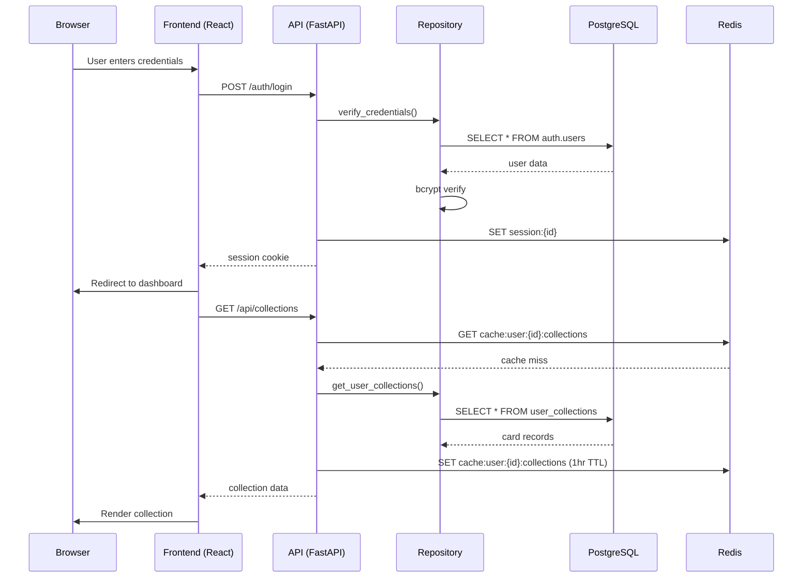
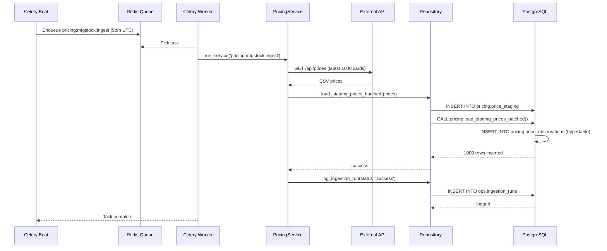
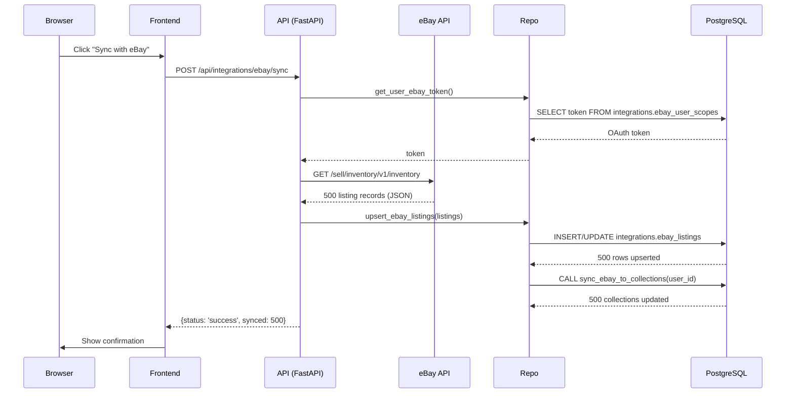

# Master Architecture Documentation Implementation Plan

> **For agentic workers:** REQUIRED SUB-SKILL: Use superpowers:subagent-driven-development (recommended) or superpowers:executing-plans to implement this plan task-by-task. Steps use checkbox (`- [ ]`) syntax for tracking.

**Goal:** Create a top-level master architecture document that ties together frontend, backend, and data storage into one cohesive system overview with clear data residency mapping.

**Architecture:** Single document (`docs/ARCHITECTURE_MASTER.md`) that serves as the entry point to all AutoMana documentation. It visualizes the complete system (frontend → nginx → backend → {PostgreSQL, Redis}), maps where all data lives, shows cross-system flows, and provides navigation to both frontend and backend master indices.

**Tech Stack:** Mermaid diagrams (architecture, data flow), ASCII diagrams (topology), Markdown tables (data residency map)

---

## File Structure

**Files to Create:**
- `docs/ARCHITECTURE_MASTER.md` — top-level system overview with data residency map

**Files to Reference:**
- `docs/FRONTEND.md` — will be created by frontend plan
- `docs/BACKEND.md` — will be created by backend plan
- `docs/frontend/` — folder structure created by frontend plan
- `docs/backend/` — folder structure created by backend plan

---

## Implementation Tasks

### Task 1: Create Master Architecture Document Shell

**Files:**
- Create: `docs/ARCHITECTURE_MASTER.md`

- [ ] **Step 1: Create directory and file**

```bash
touch /home/arthur/projects/AutoMana/docs/ARCHITECTURE_MASTER.md
```

- [ ] **Step 2: Write document header and structure**

```markdown
# AutoMana Architecture Master

Complete system overview, data residency mapping, and navigation to all specialized documentation.

## Quick Navigation

- **Frontend Documentation:** [See docs/FRONTEND.md](FRONTEND.md) — React app architecture
- **Backend Documentation:** [See docs/BACKEND.md](BACKEND.md) — FastAPI server architecture

---

## Table of Contents

1. System Overview Diagram
2. Data Residency Map
3. Cross-System Data Flows
4. Critical Paths & Dependencies
5. Documentation Navigator

---

## System Overview Diagram

[TO BE COMPLETED IN TASK 2]

---

## Data Residency Map

[TO BE COMPLETED IN TASK 3]

---

## Cross-System Data Flows

[TO BE COMPLETED IN TASK 4]

---

## Critical Paths & Dependencies

[TO BE COMPLETED IN TASK 5]

---

## Documentation Navigator

[TO BE COMPLETED IN TASK 6]
```

- [ ] **Step 3: Commit**

```bash
git add docs/ARCHITECTURE_MASTER.md
git commit -m "docs: create master architecture document structure"
```

---

### Task 2: Add System Overview Diagram

**Files:**
- Modify: `docs/ARCHITECTURE_MASTER.md` (replace section placeholder)

- [ ] **Step 1: Add Mermaid system architecture diagram**

Replace the "System Overview Diagram" section with:

```markdown
## System Overview Diagram

```mermaid
graph TB
    subgraph Client["Client Layer"]
        Browser["Browser"]
    end
    
    subgraph Network["Network Layer"]
        Nginx["nginx Reverse Proxy<br/>(80/443 TLS)")
    end
    
    subgraph Backend["Backend Layer"]
        FastAPI["FastAPI Server<br/>(async handlers)"]
        ServiceMgr["ServiceManager<br/>(DI + Service Registry)"]
    end
    
    subgraph Data["Data Layer"]
        PG["PostgreSQL<br/>+ TimescaleDB<br/>+ pgvector"]
        Redis["Redis<br/>(Cache, Queue)"]
    end
    
    subgraph External["External Integrations"]
        eBay["eBay API"]
        Shopify["Shopify API"]
        Scryfall["Scryfall Bulk Data"]
        MTGJson["MTGJson API"]
        MTGStock["MTGStock API"]
    end
    
    subgraph Jobs["Background Processing"]
        Celery["Celery Workers"]
        Beat["Celery Beat<br/>(Scheduler)"]
    end
    
    Browser -->|HTTP/HTTPS| Nginx
    Nginx -->|HTTP| FastAPI
    FastAPI -->|Query/Command| ServiceMgr
    ServiceMgr -->|Repository calls| PG
    ServiceMgr -->|Get/Set| Redis
    
    Celery -->|Task execution| ServiceMgr
    Beat -->|Enqueue tasks| Redis
    
    FastAPI -.->|sync (manual)| eBay
    FastAPI -.->|sync (manual)| Shopify
    FastAPI -.->|ETL (scheduled)| Scryfall
    FastAPI -.->|ETL (scheduled)| MTGJson
    FastAPI -.->|ETL (scheduled)| MTGStock
    
    style Client fill:#e1f5ff
    style Network fill:#fff3e0
    style Backend fill:#f3e5f5
    style Data fill:#e8f5e9
    style External fill:#fce4ec
    style Jobs fill:#ede7f6
```

**Legend:**
- Solid arrows: Request/response paths
- Dotted arrows: Integration/sync paths
- Subgraphs: Logical system zones

---

### Task 3: Add Data Residency Map

**Files:**
- Modify: `docs/ARCHITECTURE_MASTER.md` (replace section placeholder)

- [ ] **Step 1: Add data residency table**

Replace the "Data Residency Map" section with:

```markdown
## Data Residency Map

### PostgreSQL (Primary Data Store)

| Table/Schema | Purpose | Key Columns | Ownership |
|---|---|---|---|
| `card_catalog.*` | Card definitions (normalized) | id, name, scryfall_id | Scryfall pipeline |
| `user_collections.*` | User card collections | user_id, card_id, quantity | User APIs |
| `pricing.price_observations` | TimescaleDB hypertable for price history | time, card_id, source, price | MTGStock/MTGJson pipelines |
| `pricing.price_staging` | Staging table for bulk price loads | — | MTGStock/MTGJson pipelines |
| `auth.sessions` | User session tokens | user_id, session_id, expires_at | Auth middleware |
| `card_embeddings.*` | pgvector embeddings for similarity search | card_id, embedding | Scryfall enrichment |
| `integrations.ebay_user_scopes` | eBay OAuth scopes per user | user_id, scope, grant_type | eBay integration |
| `integrations.ebay_listings` | Cached eBay listing data | user_id, listing_id, title, price | eBay sync |
| `ops.ingestion_runs` | ETL pipeline execution tracking | run_id, pipeline, status, started_at | Pipeline execution |

### Redis (Cache & Queue)

| Key Pattern | Purpose | TTL | Size Estimate |
|---|---|---|---|
| `session:{session_id}` | Active user session | 30 days | ~1KB per session |
| `user:{user_id}:profile` | Cached user profile data | 1 hour | ~500B per user |
| `celery:queue:*` | Celery task queues | — | Variable (drains as tasks process) |
| `celery:result:{task_id}` | Task execution results | 1 hour | ~1-100KB per task |
| `cache:card:{card_id}` | Card detail cache | 7 days | ~2-5KB per card |
| `cache:prices:{card_id}` | Cached price data | 1 hour | ~500B per card |

### File System

| Location | Purpose | Ownership | Notes |
|---|---|---|---|
| `/data/postgres/` | PostgreSQL data files (Docker bind mount) | PostgreSQL | Persistent storage |
| `/data/automana_data/mtgstocks/raw/prints/` | Raw MTGStock CSV files | MTGStock pipeline | Downloaded, not committed to git |
| `/data/mtgjson/` | MTGJson bulk data cache | MTGJson pipeline | Downloaded, cached for processing |
| `src/frontend/dist/` | Built React app (static assets) | Frontend build | Served by nginx |
| `logs/` | Application logs (if file-based) | Celery/FastAPI | Usually aggregated to stdout (Docker) |

### External Services

| Service | Data | Rate Limits | Auth |
|---|---|---|---|
| **eBay API** | User listings, orders, inventory | 10,000 calls/day per app | OAuth 2.0 tokens (stored encrypted in DB) |
| **Shopify API** | Products, orders | 2 requests/second per store | API key + password (in env vars) |
| **Scryfall** | Complete card database | 50ms between requests | Rate limit headers (no auth) |
| **MTGJson** | All Magic card data | 1 request/day | None |
| **MTGStock** | Current market prices | 1 request/day | API key (in env var) |

---

### Task 4: Add Cross-System Data Flows

**Files:**
- Modify: `docs/ARCHITECTURE_MASTER.md` (replace section placeholder)

- [ ] **Step 1: Add data flow sequences**

Replace the "Cross-System Data Flows" section with:

```markdown
## Cross-System Data Flows

### Flow 1: User Login & Collection Sync



**Data moved:** User ID → session token → cached collection data

---

### Flow 2: Nightly ETL Pipeline (Pricing)



**Data moved:** External prices → staging → time-series database → price cache invalidation

---

### Flow 3: eBay Integration (User Manual Sync)



**Data moved:** eBay API → database → user collection sync

---

## Critical Paths & Dependencies

### Path 1: API → Database

All user-facing API requests depend on:
1. **nginx** (routing, TLS)
2. **FastAPI** (request handling, dependency injection via ServiceManager)
3. **PostgreSQL** (data persistence)
4. **Redis** (session storage, caching)

**Failure impact:** Entire system unavailable

---

### Path 2: Celery Workers → Database

Background jobs depend on:
1. **Redis** (task queue, broker)
2. **Celery** (workers, scheduler)
3. **PostgreSQL** (data updates)

**Failure impact:** Nightly ETL pipelines fail, pricing data stale

---

### Path 3: Integrations → Database

External data ingestion depends on:
1. **External APIs** (Scryfall, MTGJson, MTGStock, eBay, Shopify)
2. **Celery** (scheduled tasks)
3. **PostgreSQL** (data storage)

**Failure impact:** Specific pipelines fail (prices not updated, cards not synced, etc.)

---

### Dependency Bottlenecks

| Bottleneck | Impact | Mitigation |
|---|---|---|
| PostgreSQL max connections | All requests blocked if pool exhausted | Monitor pool usage, tune connection limits |
| Redis memory | Cache eviction, session loss | Monitor memory, implement eviction policy |
| Celery worker count | Slow pipeline execution | Scale workers based on queue depth |
| External API rate limits | Ingest failures | Implement retry + backoff, stagger requests |

```

---

### Task 5: Add Critical Paths Section

**Files:**
- Modify: `docs/ARCHITECTURE_MASTER.md` (critical paths already added in Task 4)

- [ ] **Step 1: Verify critical paths are complete from Task 4**

The critical paths and dependencies section was already added in Task 4. Proceed to Task 6.

---

### Task 6: Add Documentation Navigator

**Files:**
- Modify: `docs/ARCHITECTURE_MASTER.md` (replace section placeholder)

- [ ] **Step 1: Add navigation table**

Replace the "Documentation Navigator" section with:

```markdown
## Documentation Navigator

### Frontend Documentation

**Master Index:** [docs/FRONTEND.md](FRONTEND.md)

| Topic | Document | Folder |
|---|---|---|
| **Architecture & Patterns** | | |
| Component architecture & design system | `docs/frontend/architecture/COMPONENTS.md` | architecture |
| Routing & navigation | `docs/frontend/architecture/ROUTING.md` | architecture |
| State management | `docs/frontend/architecture/STATE_MANAGEMENT.md` | architecture |
| **Integration & Data** | | |
| API integration & data fetching | `docs/frontend/integration/API_INTEGRATION.md` | integration |
| Authentication & authorization | `docs/frontend/integration/AUTHENTICATION.md` | integration |
| **User Experience** | | |
| Forms & validation | `docs/frontend/user-experience/FORMS.md` | user-experience |
| **Quality & Deployment** | | |
| Testing strategy | `docs/frontend/quality-operations/TESTING.md` | quality-operations |
| Build, deployment & performance | `docs/frontend/quality-operations/BUILD_DEPLOYMENT.md` | quality-operations |

---

### Backend Documentation

**Master Index:** [docs/BACKEND.md](BACKEND.md)

| Topic | Document | Folder |
|---|---|---|
| **Architecture & Patterns** | | |
| Layered architecture | `docs/backend/architecture/LAYERED_ARCHITECTURE.md` | architecture |
| Service discovery & dependency injection | `docs/backend/architecture/SERVICE_DISCOVERY.md` | architecture |
| Request flows (HTTP, Celery) | `docs/backend/architecture/REQUEST_FLOWS.md` | architecture |
| **Data Layer** | | |
| Database schema design | `docs/backend/data-layer/DATABASE_SCHEMA.md` | data-layer |
| Repository pattern | `docs/backend/data-layer/REPOSITORY_PATTERN.md` | data-layer |
| Migrations | `docs/backend/data-layer/MIGRATIONS.md` | data-layer |
| **Integrations** | | |
| eBay integration | `docs/backend/integrations/EBAY_INTEGRATION.md` | integrations |
| Shopify integration | `docs/backend/integrations/SHOPIFY_INTEGRATION.md` | integrations |
| Scryfall ETL pipeline | `docs/backend/integrations/SCRYFALL_PIPELINE.md` | integrations |
| MTGJson ETL pipeline | `docs/backend/integrations/MTGJSON_PIPELINE.md` | integrations |
| MTGStock ETL pipeline | `docs/backend/integrations/MTGSTOCK_PIPELINE.md` | integrations |
| **Background Jobs** | | |
| Celery architecture | `docs/backend/background-jobs/CELERY_ARCHITECTURE.md` | background-jobs |
| Pipeline patterns | `docs/backend/background-jobs/PIPELINE_PATTERNS.md` | background-jobs |
| Monitoring & observability | `docs/backend/background-jobs/MONITORING.md` | background-jobs |
| **Operations** | | |
| Logging strategy | `docs/backend/operations/LOGGING_STRATEGY.md` | operations |
| Security | `docs/backend/operations/SECURITY.md` | operations |
| Deployment | `docs/backend/operations/DEPLOYMENT.md` | operations |
| Performance & optimization | `docs/backend/operations/PERFORMANCE.md` | operations |
| **Testing** | | |
| Testing strategy | `docs/backend/testing/TESTING_STRATEGY.md` | testing |
| API testing flow | `docs/backend/testing/API_TESTING.md` | testing |

---

### Quick Reference: "How Do I..."

| Question | Document |
|---|---|
| Understand the overall architecture | Start here (ARCHITECTURE_MASTER.md) |
| Add a new API endpoint | `docs/backend/architecture/LAYERED_ARCHITECTURE.md` |
| Add a new React component | `docs/frontend/architecture/COMPONENTS.md` |
| Debug a slow API | `docs/backend/operations/PERFORMANCE.md` |
| Write tests for a feature | `docs/frontend/quality-operations/TESTING.md` + `docs/backend/testing/TESTING_STRATEGY.md` |
| Integrate a new external API | `docs/backend/integrations/EBAY_INTEGRATION.md` (reference impl) |
| Deploy to production | `docs/backend/operations/DEPLOYMENT.md` |
| Understand auth flow | `docs/frontend/integration/AUTHENTICATION.md` + `docs/backend/operations/SECURITY.md` |
| Trace a data flow | Start with the relevant diagram in ARCHITECTURE_MASTER.md, then dive into specific docs |
| Find existing documentation | Use the navigator tables above |

```

- [ ] **Step 2: Commit**

```bash
git add docs/ARCHITECTURE_MASTER.md
git commit -m "docs: add system overview, data residency, flows, and navigator to master architecture"
```

---

### Task 7: Verify Master Document and Prepare for Review

**Files:**
- Read: `docs/ARCHITECTURE_MASTER.md`

- [ ] **Step 1: Verify document structure**

```bash
head -50 /home/arthur/projects/AutoMana/docs/ARCHITECTURE_MASTER.md
```

Expected output: Document header with title, quick navigation, and table of contents.

- [ ] **Step 2: Verify all sections are present**

Check that the document contains:
- ✅ System Overview Diagram (Mermaid graph)
- ✅ Data Residency Map (PostgreSQL, Redis, File System, External Services tables)
- ✅ Cross-System Data Flows (3 sequence diagrams + descriptions)
- ✅ Critical Paths & Dependencies (section with bottleneck table)
- ✅ Documentation Navigator (Frontend, Backend, Quick Reference)

- [ ] **Step 3: Final commit**

```bash
git add docs/ARCHITECTURE_MASTER.md
git commit -m "docs: complete master architecture document with all sections"
```

---

## Summary

Master architecture document now complete with:
- ✅ System overview showing client → nginx → backend → {PostgreSQL, Redis, Celery} flow
- ✅ Data residency map (32 tables/schemas, 6 Redis patterns, 5 file locations, 5 external services)
- ✅ 3 detailed cross-system data flow diagrams (login/sync, ETL pipeline, eBay integration)
- ✅ Critical paths and dependency bottleneck analysis
- ✅ Navigator tables linking to all frontend and backend documentation

**Next Steps:**
- Frontend documentation plan will create `docs/FRONTEND.md` (master index) + 8 deep-dive documents
- Backend documentation plan will create `docs/BACKEND.md` (master index) + 20 deep-dive documents
- All cross-references will be verified during finalization

